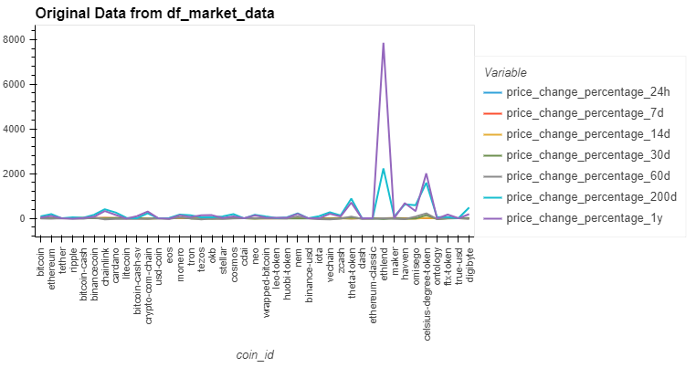
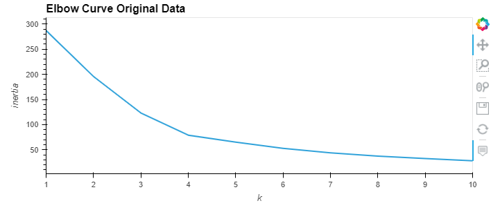
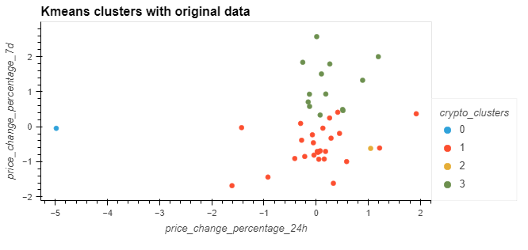
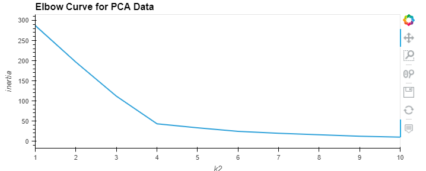
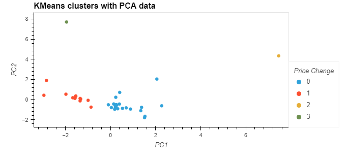

# Mod10_challenge: Clustering Crypto Investments using KMeans and PCA

This program uses Unsupervised Learning methods such as the elbow method, KMeans analysis and Principle Componants Analysis (PCA)
to segment cryptocurrency data and look for cluster patterns. Output includes clustering on the original data and on data
simplified to 3 PCA factors.

#Data
The data comes from a csv file called crypto_market_data.csv stored in the Resources folder

'''
Path("Resources/crypto_market_data.csv")
'''

#Technical
This program requires several python libraries:

'''
import pandas as pd
import hvplot.pandas
from path import Path
from sklearn.cluster import KMeans
from sklearn.decomposition import PCA
from sklearn.preprocessing import StandardScaler
'''

#Output - Original Data

The original data consists of cryptocurrency coin names and price change percentages for each coin
at 24 hours, 7 days, 14 days, 30 days, 60 days, 200 days and 1 year.

The program uses the elbow method to find the best k fit for the original data using a range of 1 to 11.

The best fit for k in the original data is 4, so that is used in the KMeans analysis using the 
Model, Fit, Predict method.

#Output - PCA converted data

The program created a PCA instance with 3 components that explained 88% of the variance.

The program uses the elbow method to find the best k fit for the PCA data using a range of 1 to 11.

The best fit for k in the original data is 4, so that is used in the KMeans analysis using the 
Model, Fit, Predict method.

#Creator
Developed by Ann Howell with support from the Rice University FinTech Bootcamp

#License
MIT
